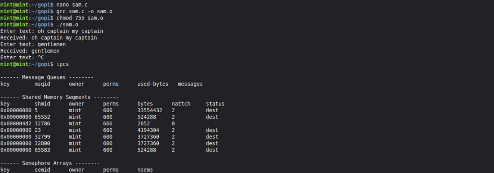

# Linux-IPC-Shared-memory
Ex06-Linux IPC-Shared-memory

# AIM:
To Write a C program that illustrates two processes communicating using shared memory.

# DESIGN STEPS:

### Step 1:

Navigate to any Linux environment installed on the system or installed inside a virtual environment like virtual box/vmware or online linux JSLinux (https://bellard.org/jslinux/vm.html?url=alpine-x86.cfg&mem=192) or docker.

### Step 2:

Write the C Program using Linux Process API - Shared Memory

### Step 3:

Execute the C Program for the desired output. 

# PROGRAM:

## Write a C program that illustrates two processes communicating using shared memory.
```
#include <stdio.h>
#include <stdlib.h>
#include <string.h>
#include <unistd.h>
#include <sys/shm.h>
#include <sys/wait.h>

struct shared_st {
    int written;
    char text[2048];
};

int main() {
    int id = shmget((key_t)1234, sizeof(struct shared_st), 0666 | IPC_CREAT); // Create [cite: 89]
    struct shared_st *stuff = shmat(id, NULL, 0); // Attach [cite: 98]
    stuff->written = 0;

    if (fork() == 0) { // Child (Consumer) [cite: 109]
        while (1) {
            if (stuff->written) {
                printf("Received: %s", stuff->text);
                if (strncmp(stuff->text, "end", 3) == 0) break;
                stuff->written = 0;
            }
            sleep(1);
        }
        shmdt(stuff); // Detach 
    } else { // Parent (Producer) [cite: 124]
        while (1) {
            printf("Enter text: ");
            fgets(stuff->text, 2048, stdin);
            stuff->written = 1;
            if (strncmp(stuff->text, "end", 3) == 0) break;
            while (stuff->written == 1) sleep(1);
        }
        wait(NULL);
        shmdt(stuff); // Detach [cite: 142]
        shmctl(id, IPC_RMID, 0); // Destroy [cite: 146]
    }
    return 0;
}
```


## OUTPUT


# RESULT:
The program is executed successfully.
